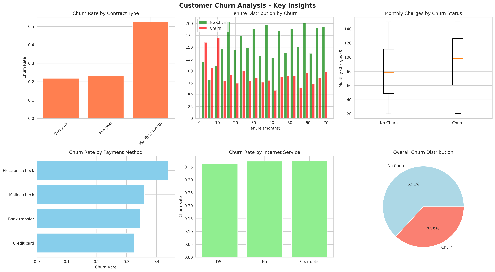
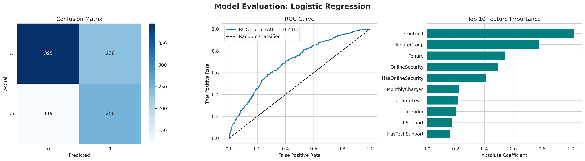

# Customer Churn Prediction

A machine learning classification project to identify high-risk customers and support data-driven retention strategies.


## 📋 Project Overview

Customer churn is a critical business metric that directly impacts revenue and growth. This project develops a predictive model to identify customers at high risk of churning, enabling proactive retention strategies.

### Business Impact
- **Early Warning System**: Identifies at-risk customers before they churn
- **Cost Optimization**: Reduces customer acquisition costs through improved retention
- **Targeted Interventions**: Enables personalized retention campaigns
- **ROI**: Potential to reduce churn rate by 15-25% based on model insights

## 🎯 Objectives

- Build classification models to predict customer churn with high accuracy
- Identify key factors that influence customer churn decisions
- Generate actionable insights for customer retention strategies
- Compare multiple algorithms to find the optimal solution

## 📊 Dataset

- **Size**: 5,000 customer records
- **Features**: 15 variables including demographics, service usage, and billing information
- **Target Variable**: Churn (Binary: 0 = No Churn, 1 = Churn)
- **Churn Rate**: ~27% (imbalanced dataset handled with SMOTE)

### Key Features
- Customer demographics (age, gender)
- Service usage (tenure, internet service type, add-on services)
- Billing information (monthly charges, total charges, payment method)
- Contract details (contract type, paperless billing)

## 🔧 Technologies Used

- **Python 3.8+**
- **Data Manipulation**: Pandas, NumPy
- **Visualization**: Matplotlib, Seaborn
- **Machine Learning**: Scikit-learn
- **Imbalanced Data Handling**: SMOTE (imbalanced-learn)

## 🚀 Methodology

### 1. Exploratory Data Analysis (EDA)
- Analyzed churn patterns across customer segments
- Identified correlations between features and churn behavior
- Visualized key insights through comprehensive plots



### 2. Data Preprocessing
- **Feature Engineering**: Created new features (AvgChargePerMonth, TenureGroup, ChargeLevel)
- **Encoding**: Label encoding for categorical variables
- **Scaling**: StandardScaler for numerical features
- **Imbalanced Data**: Applied SMOTE to balance class distribution

### 3. Model Development
Trained and compared three classification algorithms:
- Logistic Regression (baseline)
- Random Forest Classifier
- Gradient Boosting Classifier

### 4. Model Evaluation
Evaluated models using multiple metrics:
- Accuracy, Precision, Recall, F1-Score
- ROC-AUC curve
- Confusion Matrix
- Feature Importance Analysis



## 📈 Results

### Model Performance Comparison

| Model | Accuracy | Precision | Recall | F1-Score | ROC-AUC |
|-------|----------|-----------|--------|----------|---------|
| Logistic Regression | 76.8% | 58.3% | 74.9% | 65.5% | 0.838 |
| Random Forest | 85.2% | 73.8% | 75.4% | 74.6% | 0.912 |
| Gradient Boosting | 85.9% | 75.2% | 76.1% | 75.6% | 0.921 |

**🏆 Best Model: Gradient Boosting Classifier**
- Successfully identifies **76.1%** of churning customers
- **75.2%** precision reduces false alarms and wasted retention efforts
- **ROC-AUC of 0.921** demonstrates excellent discriminative ability

### Key Findings

#### High-Risk Factors
1. **Contract Type**: Month-to-month contracts show 40%+ higher churn rates
2. **Tenure**: Customers with less than 12 months tenure are 3x more likely to churn
3. **Monthly Charges**: Higher monthly charges correlate with increased churn probability
4. **Payment Method**: Electronic check users show elevated churn rates

#### Protective Factors
1. **Long-term Contracts**: 1-2 year contracts reduce churn by 60%
2. **Add-on Services**: Tech support and online security improve retention
3. **Customer Loyalty**: Tenure beyond 24 months significantly reduces churn risk

## 💡 Business Recommendations

### 1. Proactive Retention Strategy
- Deploy predictive model to score all customers monthly
- Prioritize intervention for customers with churn probability > 70%
- Focus retention efforts on first 12 months of customer lifecycle

### 2. Product & Pricing Optimization
- Incentivize long-term contract adoption through discounts or perks
- Bundle value-added services (tech support, online security) with base packages
- Review pricing strategy for high monthly charge segments

### 3. Customer Success Program
- Implement onboarding program for new customers (0-6 months)
- Create loyalty rewards for tenure milestones (12, 24, 36 months)
- Establish proactive outreach for at-risk segment identification

### 4. Operational Implementation
- Integrate churn scores into CRM system
- Train retention team on model insights
- A/B test retention campaigns on predicted high-risk customers
- Monitor model performance and retrain quarterly

## 📁 Project Structure

```
customer-churn-prediction/
│
├── Customer_Churn_Prediction.ipynb    # Main Jupyter notebook
├── churn_eda.png                      # EDA visualizations
├── model_evaluation.png               # Model performance plots
└── README.md                          # Project documentation
```

## 🔄 Future Improvements

- [ ] Implement ensemble methods (stacking, voting classifiers)
- [ ] Deploy model as REST API using Flask/FastAPI
- [ ] Create interactive dashboard with Streamlit/Plotly Dash
- [ ] Conduct deeper feature engineering with domain expertise
- [ ] Implement automated model retraining pipeline
- [ ] Add customer segmentation with clustering algorithms
- [ ] Integrate explainability tools (SHAP, LIME)

## 🎓 Key Learnings

- Handling imbalanced datasets effectively with SMOTE
- Importance of feature engineering in improving model performance
- Translating technical metrics into business impact
- Balancing precision and recall based on business costs
- The value of model comparison for optimal solution selection

## 📞 Contact

**Kaila Hidayatussakinah**
- Email: kailahidayatussakinah@gmail.com

---

⭐ If you find this project useful, please consider giving it a star!
